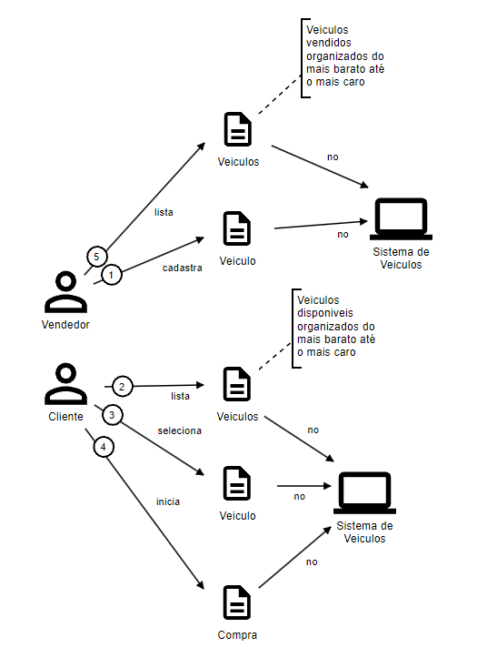

# Introdução
Uma empresa de revenda de veículos automotores nos contratou pois quer implantar uma
plataforma que funcione na internet, sendo assim, temos que criar a plataforma. O time de UX já
está criando os designs, e ficou sob sua responsabilidade criar a API. O desenho da solução
envolve as seguintes necessidades do negócio:
- Cadastrar um veículo para venda (Marca, modelo, ano, cor e preço);
- Editar os dados do veículo;
- Efetuar a venda de um veículo (CPF da pessoa que comprou, data da venda);
- Listagem de veículos à venda, ordenada por preço, do mais barato para o mais caro;
- Listagem de veículos vendidos, ordenada por preço, do mais barato para o mais caro.
  
É necessário registrar todas as datas de alteração das informações relacionadas ao veículo,
seja de cadastro, edição e venda.
Importante: nem todos os campos e funcionalidades necessárias para atender os
requisitos estão descritos acima, por isso a modelagem é fundamental para entender como
resolver o problema e entender o que precisa ser feito para que a solução funcione.

---

# Domínio da empresa de veículos automotores
> **Venda**

# DDD
Controle de gerenciamento/venda de veículos

## Sudbominio Principal
- Venda de veículos
- Gerenciamento dos veiculos

## Subdominio Genérico
- Listagem de veiculos a venda
- Listagem de veiculos vendidos

## Subdominio Suporte


## Linguagem ubíqua

### Dicionario
- Cliente: Toda pessoa que inicia o processo de compra de um veiculo.
- Veiculo: Todo o veiculo comercializado pela empresa
- Venda: Processo de venda de um veiculo para um cliente;
- Compra: Processo de compra de um veiculo por um cliente;
- Vendedor: Todo funcionário da empresa responsável por gerenciar os veiculos.

## Event Storming
> Acesse https://miro.com/app/board/uXjVLWyqN2E=/?share_link_id=69846078093

## Domain Storytelling

### Dominio Puro


### Dominio Digitalizado


----

# Executando o projeto
- Instalar dependencias
```shelll
npm i
docker compose up
```
## Como rodar locamente
- Para rodar o projeto basta executar o comando abaixo.
```shelll
docker compose up
```

## Como testar
- Segue abaixo collection com todos os endpoints disponíveis para teste.


# API
## Rotas
> Documentacao das rotas disponiveis, elas podem ser acessadas tambem nessa collection (xxxxxxxxxxxxxxxxxxxxxxxx)
> 
### Veiculo
- Path `/veiculo`
    - **POST**: Cria um novo veiculo
      - **HTTP Code**:
        - 200 - cadastrado corretamente
        - 403 - payload com dados invalidos
  - **Payload**
```json
{
"marca": "GM",
"modelo": "S10",
"ano": "2024",
"cor": "Cinza",
"valor": 124000.99,
"status": "V"
}
```
- **Resposta**
```json
{
"id": "5a68ef06-1b8c-11ee-8fe5-023afac12b88",
"marca": "GM",
"modelo": "S10",
"ano": "2024",
"cor": "Cinza",
"valor": 124000.99,
"status": "V",
}
```
- Path `/veiculo/{{id}}`
    - **PATH**: Edita um veiculo
      - **HTTP Code**:
        - 200 - alterado corretamente
        - 403 - payload com dados invalidos
  - **Payload**
```json
{
"id": "5a68ef06-1b8c-11ee-8fe5-023afac12b88",
"marca": "GM",
"modelo": "S10",
"ano": "2024",
"cor": "Prata",
"valor": 124000.99,
"status": "V"
}
```
- **Resposta**
```json
{
"id": "5a68ef06-1b8c-11ee-8fe5-023afac12b88",
"marca": "GM",
"modelo": "S10",
"ano": "2024",
"cor": "Prata",
"valor": 124000.99,
"status": "V"
}
```
- Path `/veiculo/{{id}}`
    - **DELETE**: Deleta um veiculo
      - **HTTP Code**:
        - 200 - deletou o veiculo com sucesso
        - 403 - produto nao existe
- **Resposta**
```json
{
 "success": true
}
```
- Path `/veiculo/{{id}}`
    - **GET**: Busca um veiculo
      - **HTTP Code**:
        - 200 - encontrou o veiculo com sucesso
        - 404 - veiculo nao existe
- **Resposta**
```json
{
 "success": true
}
```
- Path `/veiculo/status/D/?price=ASC`
    - **GET**: Lista todos os veiculos disponiveis do mais barato para mais caro 
      - **HTTP Code**:
        - 200 - retornou dados
- **Resposta**
```json
[
 {
  "id": "5b48ef06-1b8c-11ee-8fe5-023afac12b88",
  "marca": "GM",
  "modelo": "S10",
  "ano": "2024",
  "cor": "Prata",
  "valor": 124000.99,
  "status": "D"
},
 {
  "id": "5a68ef06-1b8c-11ee-8fe5-023afac12b32",
  "marca": "GM",
  "modelo": "S10",
  "ano": "2022",
  "cor": "Preto",
  "valor": 114000.99,
  "status": "D"
},
]
```
- Path `/veiculo/status/V/?price=DESC`
    - **GET**: Lista todos os veiculos vendidos do mais caro para mais barato
      - **HTTP Code**:
        - 200 - retornou dados
- **Resposta**
```json
[
 {
  "id": "5b48ef06-1b8c-11ee-8fe5-023afac12b88",
  "marca": "GM",
  "modelo": "S10",
  "ano": "2024",
  "cor": "Prata",
  "valor": 124000.99,
  "status": "V"
},
 {
  "id": "5a68ef06-1b8c-11ee-8fe5-023afac12b32",
  "marca": "GM",
  "modelo": "S10",
  "ano": "2022",
  "cor": "Preto",
  "valor": 114000.99,
  "status": "V"
},
]
```

### Venda
- Path `/venda`
    - **POST**: Cria uma nova venda
      - **HTTP Code**:
        - 200 - cadastrado corretamente
        - 403 - payload com dados invalidos
  - **Payload**
```json
{
"idVeiculo": "5b48ef06-1b8c-11ee-8fe5-023afac12b88",
"data_compra": "2024-01-01 00:00:00",
"cpf": "185.612.250-68",
"valor": 124000.00
}
```
- **Resposta**
```json
{
"id": "5a68ef06-1b8c-11ee-8fe5-023afac12b88",
"idVeiculo": "5b48ef06-1b8c-11ee-8fe5-023afac12b88",
"data_compra": "2024-01-01 00:00:00",
"cpf": "185.612.250-68",
"valor": 124000.00
}
```
- Path `/venda`
    - **GET**: Lista todas as vendas
      - **HTTP Code**:
        - 200
- **Resposta**
```json
[
{
"id": "5a68ef06-1b8c-11ee-8fe5-023afac12b88",
"idVeiculo": "5b48ef06-1b8c-11ee-8fe5-023afac12b88",
"data_compra": "2024-01-01 00:00:00",
"cpf": "185.612.250-68",
"valor": 124000.00
},
{
"id": "8j68ef06-1b8c-11ee-8fe5-023afac12b8432",
"idVeiculo": "5b48ef06-1b8c-11ee-8fe5-8j68ef06",
"data_compra": "2024-01-01 00:00:00",
"cpf": "000.000.00-00",
"valor": 124000.00
}
]
```

